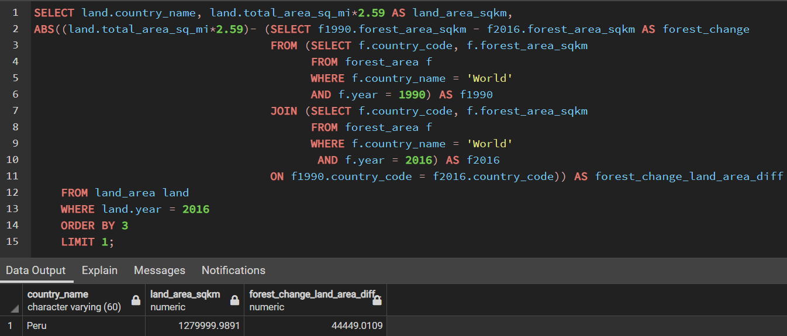

# **Data Exploration of Global Deforestation from 1990 to 2016**

### Table of Contents
<ul>
<li><a href="#intro">Introduction</a></li>
<li><a href="#globe">Global</a></li>
<li><a href="#region">Regional</a></li>
<li><a href="#country">Country</a></li>
<li><a href="#conclusions">Conclusions</a></li>
</ul>

## INTRODUCTION

> This repo contains the SQL queries used to analyze Global deforestation data between 1990 and 2016 by regions and countries as obtained from the World Bank.
In a bid to raise awareness about the subject, make informed decisions to help combat deforestation, and in light of the adverse effect of human activities and climate change on the environment, we set out on this exploration to gain insights into the countries with diminishing forest areas as well those with vast proportions of forest area and their respective regions. The analysis is structured from `global` to `regional` and `country` geographical outlooks.
>>

##  `Global`

* **What was the total forest area (in sq km) of the world in 1990?**

* **What was the total forest area (in sq km) of the world in 2016?**

* **What was the change (_in sq km_) in the forest area of the world from 1990 to 2016?**

* **What was the percent change in forest area of the world between 1990 and 2016?**

* **Comparing the amount of forest area lost between 1990 and 2016, to which country's total area in 2016 is it closest to?**

* **

##  `Regional`
* **Create a table that shows the Regions and their percent forest area from 1990 to 2016.**

* **What was the percent forest of the entire world in 2016?**

* **Which region had the HIGHEST percent forest in 2016, and which had the LOWEST?**

* **What was the percent forest of the entire world in 1990?**

* **Which region had the HIGHEST percent forest in 1990, and which had the LOWEST?**

* **Which regions of the world DECREASED in forest area from 1990 to 2016?**

* **

##  `Country`
* **Which 5 countries saw the largest amount decrease in forest area from 1990 to 2016? _What was the difference in forest area for each?_**

* **Which 5 countries saw the largest percent decrease in forest area from 1990 to 2016? _What was the percent change for each?_**

* **If countries were grouped by percent forestation in quartiles, which group had the most countries in it in 2016?**

* **List all of the countries that were in the 4th quartile (_percent forest > 75%_) in 2016.**

* **How many countries had a percent forestation higher than the United States in 2016?**

##  CONCLUSIONS
From the exploratory analysis, we gathered that:
* The World's total forest area shrunk to 39,958,245.9 _sq.km_ in 2016 from  41,282,694.9 _sq.km_ in 1990; a 3.2% or 1,324,449 _sq.km_ decrease, almost equivalent to the entire land area of Peru.
* In the year 2016, the proportion of the World's total land area designated as forest was 31.38% against 32.42% in 1990. With decreasing proportion of forest areas within both time periods, *Latin America and the Caribbean* recorded the highest forestation, while *Middle East and North Africa* had the lowest relative forestation.
* The *Sub-Saharan Africa* and *Latin America and the Caribbean* regions decreased in percentage of forest area between 1990 and 2016 while the reverse was the case for all other regions.
* *Brazil* recorded the largest absolute decrease in forest area between 1990 and 2016 while *Togo* recorded the largest proportion decrease in forest between both time periods. However, *Nigeria* appears on both lists of countries with highest deforestation.
* As at 2016, 85 or about 41% of all countries fall in the first quartile range of countries with highest forestation. Countries with the highest percentage of land area designated as forest fall in the fourth quartile including - _Palau_, _Solomon Islands_, _Micronesia, Fed. Sts_, _Lao PDR_, _Seychelles_, _Gabon_, _American Samoa_, _Suriname_, and _Guyana._
> More focus should be placed on countries in the _East Asia & Pacific_ region as most of these countries have recorded the most forestation over time and could initiate corrective measures on a global scale. On the other hand, countries in the _Sub-Saharan Africa_ and _Latin America and the Caribbean_ regions are becoming big concerns, having the most diminishing forest areas and in dire need of remedial efforts.

#### PACKAGES USED:

- PostgreSQL

_References used for this repository include:_
- https://dba.stackexchange.com/
- https://www.postgresql.org/docs/13/queries.html
- https://www.w3schools.com/sql/
- https://www.edureka.co/blog/pl-sql-tutorial/
- https://stackoverflow.com/
- https://www.sqlshack.com/
